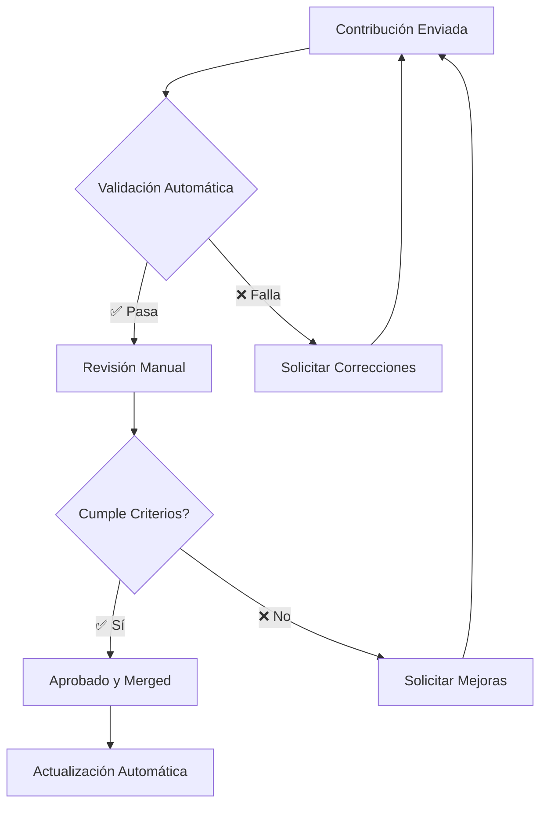

# 🤝 Guía de Contribución - DevOps YouTube Channels

¡Gracias por tu interés en contribuir a **DevOps YouTube Channels**! Este proyecto es una colección curada de los mejores canales de YouTube para aprender DevOps, Platform Engineering, Cloud Computing y tecnologías relacionadas.

## 🌟 Formas de Contribuir

### 🎯 Principales Contribuciones
- 📺 **Sugerir nuevos canales**: Comparte canales de calidad que conozcas
- 🔧 **Actualizar información**: Corrige datos desactualizados o erróneos
- 🐛 **Reportar problemas**: Informa sobre enlaces rotos o problemas técnicos
- 📚 **Mejorar documentación**: Ayuda a hacer el proyecto más claro y útil
- 💻 **Contribuir al código**: Mejora la web, scripts o automatización

### 🚀 Métodos de Contribución

#### 1. 📝 Formulario Web (Más Fácil)
- Visita [contribute.html](contribute.html) en nuestro sitio web
- Completa el formulario con la información del canal
- El sistema generará automáticamente un issue en GitHub

#### 2. 🔧 GitHub Issue (Recomendado)
- Usa nuestro [template de sugerencia de canal](https://github.com/jersonmartinez/DevOps-YouTube-Channels/issues/new?assignees=&labels=channel-suggestion%2Cneeds-review&template=channel-suggestion.yml&title=%5BCHANNEL%5D+)
- Proporciona toda la información requerida
- Nuestro equipo revisará y procesará tu sugerencia

#### 3. 🛠️ Pull Request (Avanzado)
- Fork el repositorio
- Crea una rama para tu contribución
- Agrega el canal siguiendo nuestros estándares
- Envía un Pull Request con descripción detallada

---

## 📺 Criterios de Selección de Canales

### ✅ Requisitos Obligatorios
- **Relevancia**: Contenido relacionado con DevOps, Cloud, Platform Engineering, Containers, etc.
- **Calidad**: Información técnicamente precisa y bien explicada
- **Actividad**: Al menos 1 video por mes en los últimos 6 meses
- **Idioma**: Español o Inglés
- **Profesionalismo**: Presentación clara y profesional

### 🌟 Criterios de Calidad
- **Experiencia del creador**: Profesional con experiencia demostrable
- **Valor educativo**: Contenido que enseña conceptos o habilidades
- **Engagement**: Interacción activa con la comunidad
- **Consistencia**: Uploads regulares y contenido coherente
- **Actualidad**: Cubre tecnologías y prácticas modernas

### ❌ Criterios de Exclusión
- Contenido puramente promocional
- Canales inactivos (>6 meses sin videos)
- Información incorrecta o desactualizada
- Contenido no relacionado con DevOps/Cloud
- Violaciones de derechos de autor

---

## 📋 Formato para Nuevos Canales

### 🗂️ Estructura del Archivo

Cada canal debe seguir este formato exacto:

```markdown
### Nombre del Canal
[](https://www.youtube.com/@HandleDelCanal?sub_confirmation=1)

**Canal**: https://www.youtube.com/@HandleDelCanal  
**LinkedIn**: [Nombre del Autor](https://linkedin.com/in/autor)  
**Rol**: Título/Posición del Autor  
**Etiquetas**: `#tecnologia1` `#tecnologia2` `#tecnologia3`

#### 🎯 Contenido Destacado
- Descripción breve del tipo de contenido
- Temas principales que cubre
- Valor específico que aporta a la comunidad

---
```

### 📁 Ubicación del Archivo

**Canales en Español**: Agregar en la categoría correspondiente + `Spanish-Channels.md`
**Canales en Inglés**: Agregar en la categoría correspondiente + `English-Channels.md`

#### Categorías Disponibles:
- `categories/platform-engineering.md`
- `categories/devsecops.md`
- `categories/containers.md`
- `categories/cloud.md`
- `categories/automation.md`
- `categories/homelab.md`

---

## 🔧 Proceso de Aprobación

### 🚦 Flujo de Revisión



### ⏱️ Tiempos de Respuesta
- **Validación automática**: Inmediata
- **Primera revisión**: 2-3 días hábiles
- **Revisión completa**: 5-7 días hábiles
- **Aprobación final**: 1-2 días adicionales

### 👥 Quién Revisa
- **Mantenedores principales**: Revisión de calidad y relevancia
- **Comunidad**: Feedback y sugerencias
- **Validación automática**: Verificación técnica

---

## 🛠️ Configuración de Desarrollo

### 📦 Requisitos Previos
```bash
# Python 3.11 o superior
python --version

# Git configurado
git config --global user.name "Tu Nombre"
git config --global user.email "tu@email.com"
```

### 🚀 Configuración Local
```bash
# 1. Fork y clonar el repositorio
git clone https://github.com/tuusername/DevOps-YouTube-Channels.git
cd DevOps-YouTube-Channels

# 2. Instalar dependencias
pip install -r requirements.txt

# 3. Generar datos locales
python .github/scripts/generate_channels_data.py

# 4. Ejecutar servidor local
python -m http.server 8080

# 5. Abrir en navegador
# http://localhost:8080
```

### 🧪 Testing Local
```bash
# Validar canales
python .github/scripts/validate_channels.py

# Verificar duplicados
python .github/scripts/check_duplicates.py

# Actualizar métricas (opcional)
python .github/scripts/update_youtube_metrics.py
```

---

## 📝 Ejemplos de Contribuciones

### ✅ Ejemplo Correcto

```markdown
### DevOps with Jerson
[](https://www.youtube.com/@DevOpsWithJerson?sub_confirmation=1)

**Canal**: https://www.youtube.com/@DevOpsWithJerson  
**LinkedIn**: [Jerson DevOps](https://linkedin.com/in/jerson-devops)  
**Rol**: DevOps Engineer & Content Creator  
**Etiquetas**: `#kubernetes` `#docker` `#cicd` `#aws` `#terraform`

#### 🎯 Contenido Destacado
- Tutoriales prácticos de Kubernetes y Docker
- Implementación de pipelines CI/CD en diferentes plataformas
- Mejores prácticas de Infrastructure as Code con Terraform
- Casos de uso reales de migración a la nube

---
```

### ❌ Ejemplo Incorrecto

```markdown
### Canal Genérico
Link: youtube.com/canal

Habla de tecnología en general.
```

**Problemas**:
- Falta estructura requerida
- No incluye badge de suscriptores
- URL no es completa
- Información insuficiente
- No especifica tecnologías

---

## 🤖 Validación Automática

### 🔍 Checks Automáticos
- **URLs válidas**: Verificación de formato y accesibilidad
- **Sin duplicados**: Comparación con canales existentes
- **Formato correcto**: Estructura markdown válida
- **Categorización**: Ubicación en archivos correctos
- **Seguridad**: Verificación de dominios permitidos

### 📊 Reportes Automáticos
Los PR reciben automáticamente:
- Reporte de validación de URLs
- Verificación de duplicados
- Testing de funcionalidad web
- Resumen de cambios

---

## 🏷️ Sistema de Etiquetas

### 🎯 Etiquetas de Issues
- `channel-suggestion`: Nueva sugerencia de canal
- `needs-review`: Requiere revisión manual
- `duplicate`: Canal duplicado detectado
- `invalid-url`: URL no funciona
- `enhancement`: Mejora al proyecto
- `bug`: Problema técnico
- `documentation`: Mejora en documentación

### 🔄 Etiquetas de PRs
- `new-channel`: Agrega nuevo canal
- `update-info`: Actualiza información existente
- `validation-completed`: Validación automática completada
- `ready-for-review`: Listo para revisión manual
- `needs-changes`: Requiere modificaciones

---

## 💡 Consejos para Contribuidores

### 🎯 Para Sugerencias de Canales
1. **Investiga primero**: Verifica que el canal no esté ya incluido
2. **Calidad sobre cantidad**: Mejor pocos canales excelentes que muchos regulares
3. **Información completa**: Proporciona todos los datos requeridos
4. **Contexto útil**: Explica por qué el canal es valioso
5. **Mantente actualizado**: Verifica que el canal esté activo

### 🛠️ Para Contribuciones Técnicas
1. **Sigue las convenciones**: Usa el formato establecido
2. **Tests locales**: Verifica que todo funcione antes de enviar
3. **Commits claros**: Mensajes descriptivos y concisos
4. **Un cambio por PR**: Facilita la revisión
5. **Documenta cambios**: Explica qué y por qué

### 📈 Para Mejoras del Proyecto
1. **Identifica problemas reales**: Basado en experiencia de usuario
2. **Propón soluciones**: No solo reportes problemas
3. **Considera la escalabilidad**: Soluciones que crezcan con el proyecto
4. **Mantén la simplicidad**: Evita complejidad innecesaria
5. **Piensa en la comunidad**: Beneficio para todos los usuarios

---

## 🆘 Obtener Ayuda

### 💬 Canales de Comunicación
- **GitHub Issues**: Para reportar problemas o sugerir mejoras
- **GitHub Discussions**: Para preguntas generales y discusión
- **Email**: Para asuntos privados o sensibles

### 📚 Recursos Útiles
- [README del Proyecto](README.md)
- [Página de Contribución Web](contribute.html)
- [Templates de Issues](https://github.com/jersonmartinez/DevOps-YouTube-Channels/issues/new/choose)
- [Pull Request Template](.github/PULL_REQUEST_TEMPLATE.md)

### ❓ Preguntas Frecuentes

**Q: ¿Puedo sugerir mi propio canal?**
A: Sí, siempre que cumpla con los criterios de calidad y relevancia.

**Q: ¿Cuánto tiempo toma aprobar un canal?**
A: Normalmente 5-7 días hábiles para revisión completa.

**Q: ¿Qué pasa si mi sugerencia es rechazada?**
A: Recibirás feedback específico y puedes mejorar la propuesta.

**Q: ¿Puedo sugerir canales en otros idiomas?**
A: Actualmente solo aceptamos español e inglés.

**Q: ¿Cómo se actualizan las métricas de suscriptores?**
A: Automáticamente cada semana via GitHub Actions.

---

## 📜 Código de Conducta

### 🤝 Nuestros Valores
- **Respeto**: Tratamos a todos con cortesía y profesionalismo
- **Inclusión**: Bienvenimos contribuidores de todos los backgrounds
- **Calidad**: Nos esforzamos por la excelencia en todo lo que hacemos
- **Transparencia**: Procesos claros y comunicación abierta
- **Colaboración**: Trabajamos juntos para el beneficio común

### 🚫 Comportamientos No Aceptados
- Lenguaje ofensivo o discriminatorio
- Acoso o intimidación
- Spam o contenido promocional excesivo
- Violación de derechos de autor
- Información falsa o engañosa

### ⚖️ Consecuencias
Las violaciones pueden resultar en:
- Advertencia formal
- Suspensión temporal
- Prohibición permanente

---

## 🙏 Reconocimientos

### 🌟 Contribuidores Destacados
Agradecemos a todos los que han contribuido a hacer este proyecto mejor:
- [Lista de contribuidores será actualizada automáticamente]

### 💖 Agradecimientos Especiales
- **Comunidad DevOps**: Por compartir conocimiento y recursos
- **Creadores de contenido**: Por educar y inspirar a la comunidad
- **GitHub**: Por proporcionar la plataforma para la colaboración
- **Bootstrap & JavaScript**: Por las herramientas de desarrollo web

---

## 📄 Licencia

Este proyecto está bajo la licencia [MIT](LICENSE). Al contribuir, aceptas que tus contribuciones serán licenciadas bajo la misma licencia.

---

**¿Listo para contribuir?** 🚀

1. 📝 [Usar formulario web](contribute.html) (más fácil)
2. 🔧 [Crear issue](https://github.com/jersonmartinez/DevOps-YouTube-Channels/issues/new/choose) (recomendado)
3. 🛠️ [Hacer fork y PR](https://github.com/jersonmartinez/DevOps-YouTube-Channels/fork) (avanzado)

¡Gracias por ayudar a construir el mejor recurso de aprendizaje DevOps! 🎉 